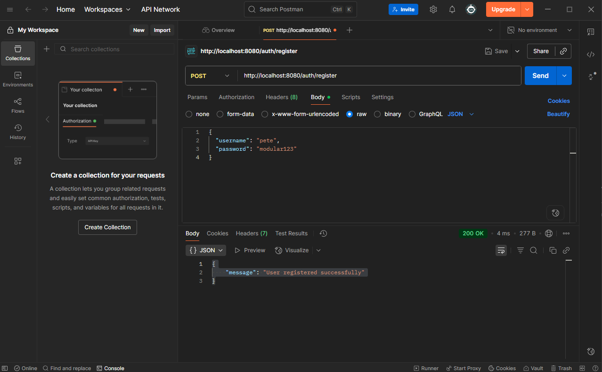
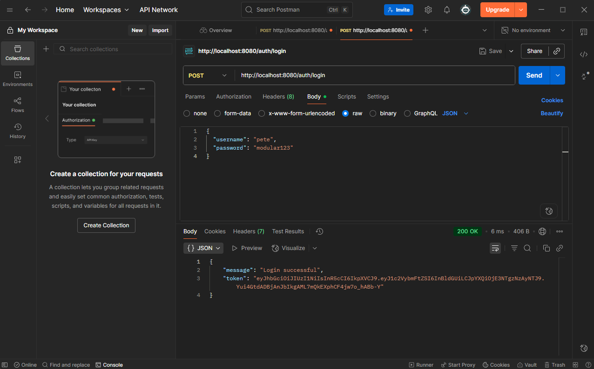
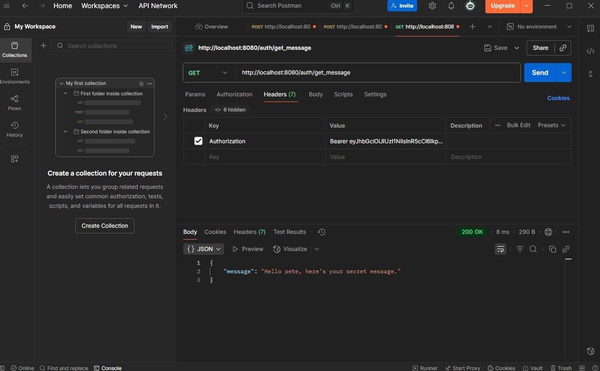
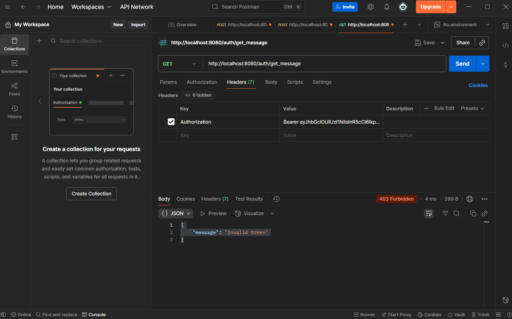
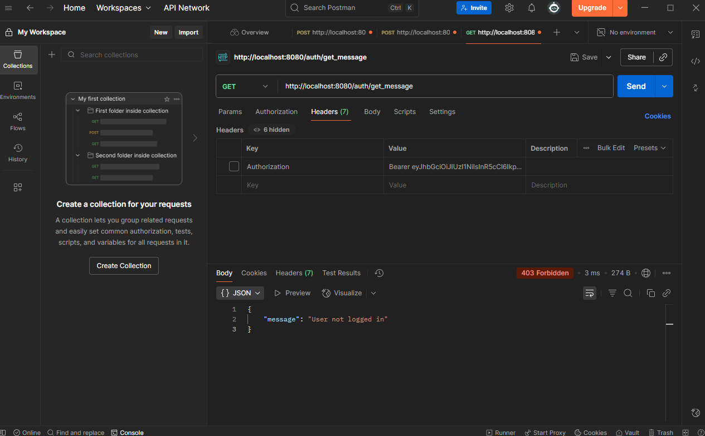

# 🔐 Express Auth Server by Pete

A modular Express.js server with JWT-based authentication, tested via Postman and documented with screenshots. Built to showcase clean routing, secure token handling, and collaborative bug-slaying rituals.

---

## 🚀 Features

- ✅ User registration and login  
- 🔐 JWT token generation and verification  
- 🔒 Protected route access  
- 🧪 Postman-tested endpoints  
- 🖼️ Screenshot-documented flow  

---

## 📦 Installation

```bash
git clone git@github.com:VipTechDev/auth-server-pete.git
cd auth-server-pete
npm install
npm start
```

Server runs at: `http://localhost:8080`

---

## 📸 Authentication Flow

### 1️⃣ Register a User  


### 2️⃣ Login and Receive Token  


### 3️⃣ Access Protected Route  


### 4️⃣ Invalid Token Example  


### 5️⃣ No Token Provided  


---

## 📂 Routes

### `POST /auth/register`  
Registers a new user with `username` and `password`.

### `POST /auth/login`  
Returns a JWT token if credentials are valid.

### `GET /auth/get_message`  
Returns a secret message if a valid token is provided in the `Authorization` header.

---

## 🧠 Built With

- [Express.js](https://expressjs.com/)
- [jsonwebtoken](https://www.npmjs.com/package/jsonwebtoken)
- [Postman](https://www.postman.com/)

---

## 🧑‍💻 Author

**Pete (VipTechDev)**  
Modular ritualist, bug-slaying collaborator, and lorebook builder.  
Connect on [LinkedIn](https://www.linkedin.com/in/peter-menet-a40752371/)

---

## 📜 License

This project is licensed under the [MIT License](LICENSE).
